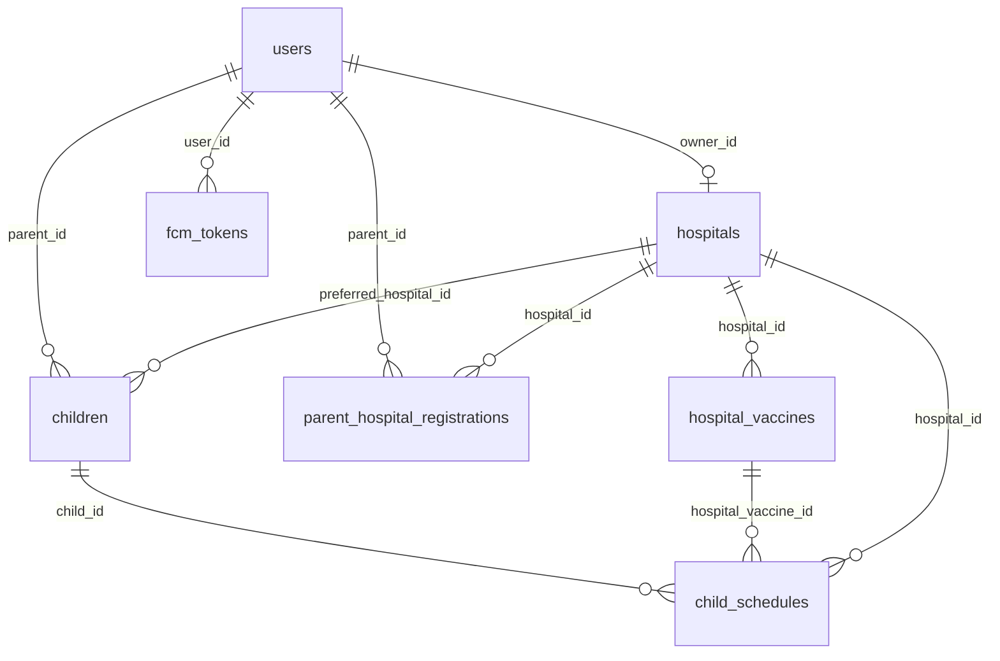
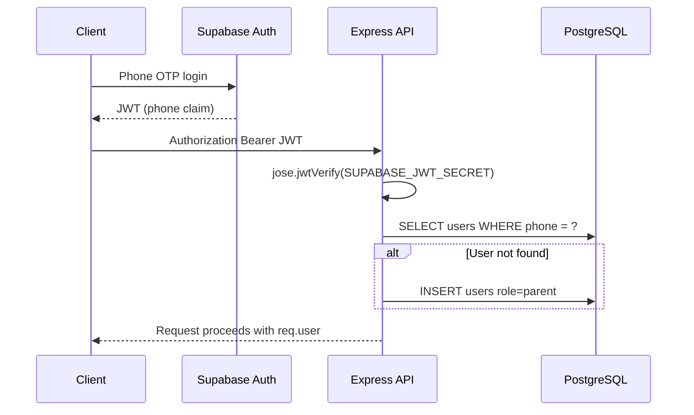

# Architecture

## System overview

```mermaid
flowchart TB
    subgraph clients [Clients]
        ParentApp[Parent Web App]
        HospitalApp[Hospital Web App]
    end

    subgraph api [Express API /api/v1]
        Auth[authenticateToken]
        UserRoutes[/user/*]
        HospitalRoutes[/hospital/*]
    end

    subgraph services [Business layer]
        ParentSvc[parent.service]
        ScheduleSvc[schedule.service]
        HospitalSvc[hospital.service]
        HospitalAdminSvc[hospital-admin.service]
        NotifSvc[notification.service]
    end

    subgraph data [Data]
        Supabase[(PostgreSQL)]
    end

    subgraph notify [Notifications]
        FCM[Firebase FCM]
        Resend[Resend Email]
        AT[Africa's Talking SMS]
    end

    subgraph jobs [Jobs]
        Cron[reminder.cron 6AM]
    end

    ParentApp --> Auth --> UserRoutes
    HospitalApp --> Auth --> HospitalRoutes
    UserRoutes --> ParentSvc
    UserRoutes --> ScheduleSvc
    UserRoutes --> HospitalSvc
    HospitalRoutes --> HospitalAdminSvc
    HospitalAdminSvc --> ScheduleSvc
    ParentSvc --> Supabase
    ScheduleSvc --> Supabase
    HospitalSvc --> Supabase
    HospitalAdminSvc --> Supabase
    Cron --> ScheduleSvc
    Cron --> NotifSvc
    NotifSvc --> FCM
    NotifSvc --> Resend
    NotifSvc -.-> AT
```

## Dual-sided model

Parents and hospitals are separate user types sharing one `users` table with a `role` enum.

| Concept | Parent | Hospital |
|---------|--------|----------|
| Identity | Phone JWT → `users` row (`role=parent`) | Phone JWT → `users` row (`role=hospital`) + `hospitals.owner_id` |
| Registration | Auto-provisioned on first auth; profile via `PATCH /user/profile` | `POST /hospital/signup` creates hospital record |
| Children | Owns `children` rows | Views/manages children where `preferred_hospital_id` matches |
| Vaccines | Consumes `hospital_vaccines` via generated schedules | CRUD on `hospital_vaccines` |
| Link | `parent_hospital_registrations` (self or manual) | Same table, hospital-initiated manual adds |

## Data model



### Core tables

| Table | Purpose |
|-------|---------|
| `users` | Parents and hospital operators (phone, name, email, country, role) |
| `hospitals` | Facility profile, geo coords, operating hours, help phone |
| `hospital_vaccines` | Per-hospital vaccine/checkup with age range, milestone, reminder_days |
| `parent_hospital_registrations` | Parent ↔ hospital link (`self` or `manual`) |
| `children` | Child profile, DOB, preferred hospital |
| `child_schedules` | Generated ledger: due dates, status, completion |
| `fcm_tokens` | Web push registration tokens per user |

## Schedule generation

Triggered when:
1. Parent creates a child **with** `preferredHospitalId`
2. Parent updates `preferred_hospital_id` on a child
3. Hospital manually adds a child

Algorithm (`schedule.service.ts`):
1. Load active `hospital_vaccines` for the hospital
2. Filter vaccines where `milestone_age_months` falls within `[age_min_months, age_max_months]`
3. `due_date = date_of_birth + milestone_age_months`
4. Batch insert into `child_schedules` with `status = pending`
5. On hospital change: delete non-completed schedules, regenerate

## Timeline sorting

`GET /user/children/:id/timeline` returns items sorted:
1. `overdue` → `due_soon` → `pending` (by `due_date` ASC)
2. `completed` (by `completed_at` DESC)

## Upcoming vaccines

`GET /user/children/:id/upcoming-vaccines` filters timeline to:
- Non-completed items
- Child's current age ≤ vaccine `age_max_months`

Requires `preferred_hospital_id` to be set.

## Authentication flow



Hospital operators call `POST /hospital/signup` after auth to set `role=hospital` and create their `hospitals` row.

## Cron pipeline (daily 6:00 AM)

1. Mark `overdue` (due_date < today, not completed)
2. Mark `due_soon` (due within 7 days, was pending)
3. Query schedules due in N days where N ∈ vaccine `reminder_days` (default 3, 1)
4. Query all overdue schedules
5. Group notifications by parent_id
6. `sendVaccinationReminder()` per parent

## Notification cascade

| Priority | Channel | When |
|----------|---------|------|
| 1 | FCM web push | Active tokens in `fcm_tokens` |
| 2 | Resend email | FCM failure + `users.email` set |
| 3 | Africa's Talking SMS | Planned — config ready, not wired in service yet |

## Proximity search

`hospital.service.ts` uses Haversine distance with a ±0.5° bounding box prefilter on `latitude`/`longitude` indexes.

## Error handling

- `AppError(statusCode, message, details?)` in services
- Zod validation → 400 via `validate()` middleware
- JWT errors → 401
- Role mismatch → 403
- Unknown errors → 500 (logged, generic message to client)

## File responsibilities

| Layer | Files | Rule |
|-------|-------|------|
| Routes | `src/routes/*.ts` | Zod schemas, middleware chain, no business logic |
| Controllers | `src/controllers/*.ts` | Thin — call service, return JSON |
| Services | `src/services/*.ts` | All business logic and DB access |
| Config | `src/config/*.ts` | External client initialization |
| Middleware | `src/middleware/*.ts` | Cross-cutting HTTP concerns |
